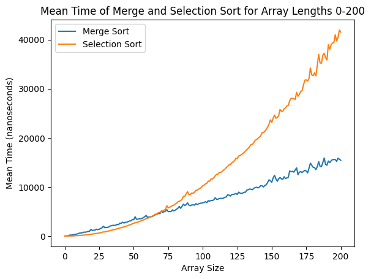

# Sort Complexity

Finding sort complexities of merge and selection sort.

## Analysis:

Analysis of the complexities can be found
at [`analysis/confidence_interval.ipynb`](https://github.com/amylnikov30/SortComplexity/blob/main/analysis/confidence_interval.ipynb).
The analysis is done in Python using a local Jupyter notebook and the graphs are plotted using matplotlib.

To re-run the analysis, the Java classes must be compiled and the required Python libraries (found
at `analysis/reqs.txt`) must be installed.

## Report

The report of the implementation and its analysis can be found
in [`docs/SortComplexity-Report.pdf`](https://github.com/amylnikov30/SortComplexity/blob/main/docs/SortComplexity_Report.pdf).

## Results overview:

#### The mean cross-over point is 67.43 with a 99% confidence interval of 66.04 to 68.83.